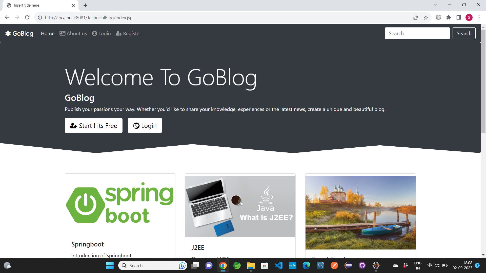
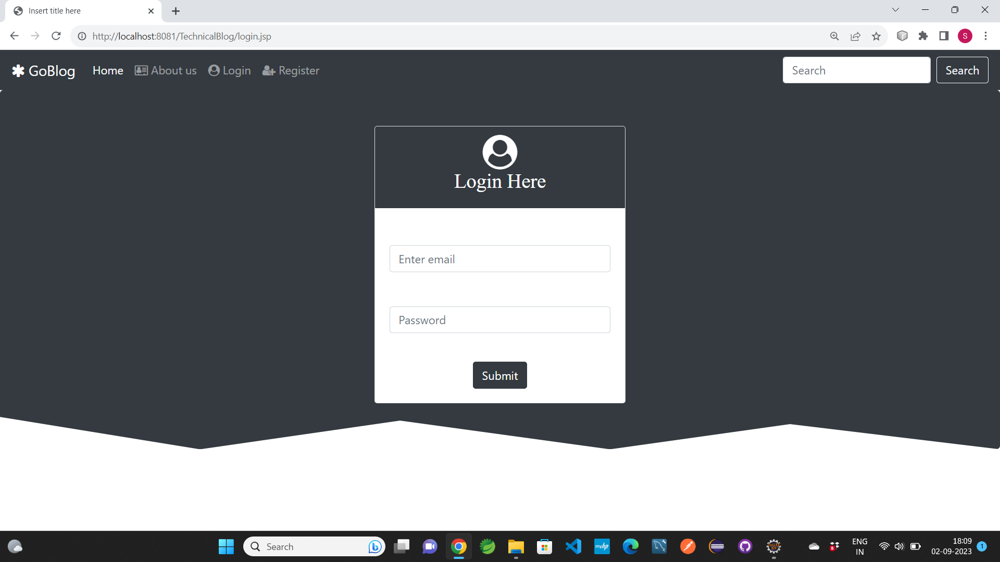
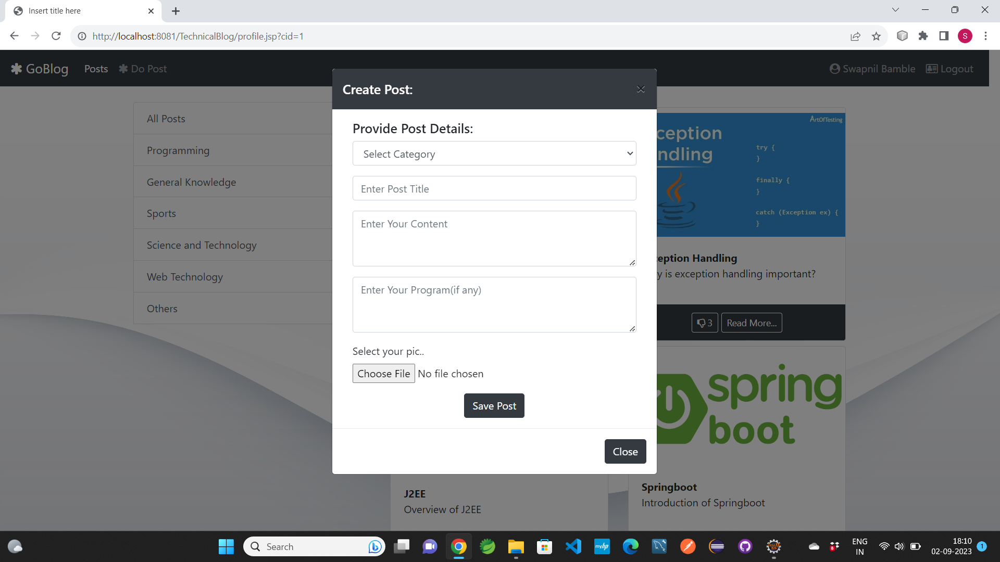
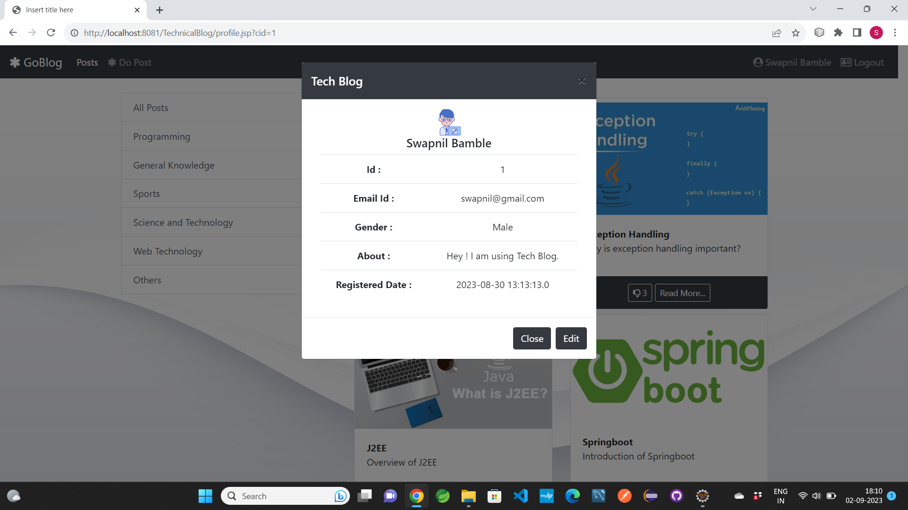
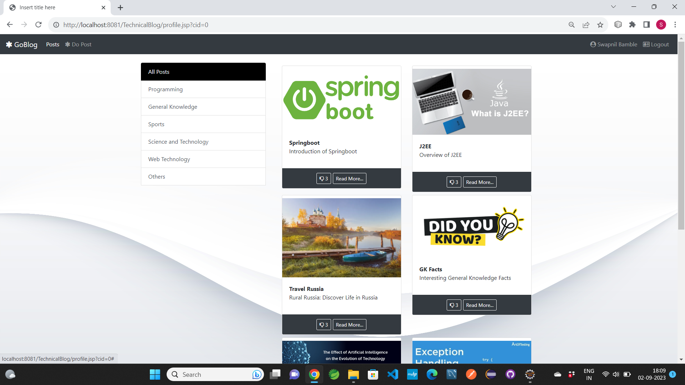
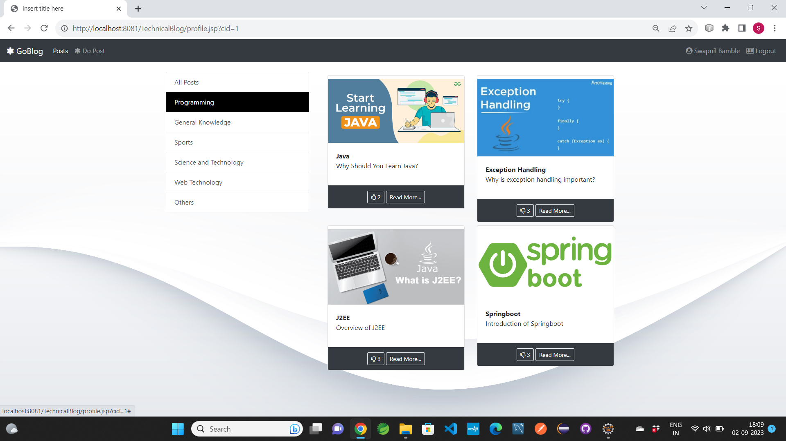
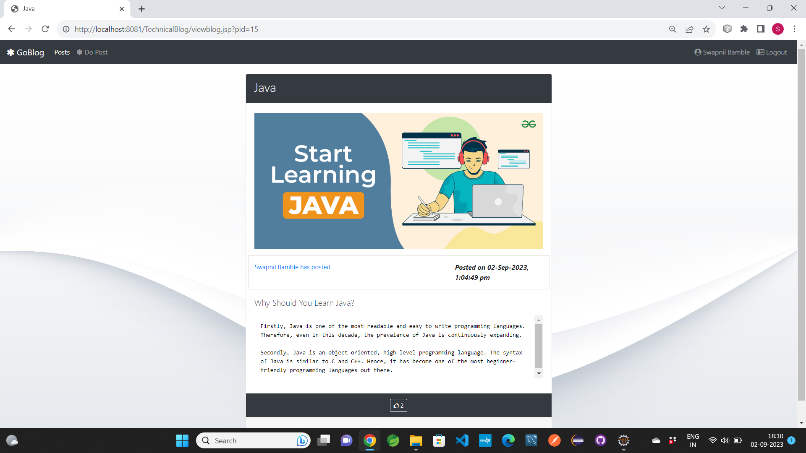

# GoBlog
## It is an Online Blogging Application. 
### It is Java J2EE Application. Build in Eclipse IDE using Maven Project.

### Technology used in this Project: 
- i) Java: all Backend logic has been written in java.
- ii) HTML,CSS and Bootstrap: designing page layout.
- iii) JSP & Javascript, Ajax: all the front end logic has been written in jsp and javascript. 
- iv) MySQL: MySQL database has been used as database. 
- v) Tomcat: project will be run over the tomcat server.
- vi) Maven: Maven is used for getting required jar files.

### Software And Tools Required:
- Java JDK 8+
- Eclipse EE
- Apache Maven
- Tomcat v8.0+
- SQLite Tools (Online or Offline Tool)

### Steps To Import And Run The Project in Eclipse EE
- In Eclipse
- Click on File
- Select Import
- Select Projects from Git(with smart import) -> Next
- Select Clone URI -> Next
- In URI paste this url: https://github.com/swapnilbamble1438/GoBlog.git
  -> Next
-  Now in Local Destination

-  proceed -> Next

            Now only select GoBlog\GoBlog
            -> Finish
  
-  If everything goes right Project will get successfully imported
-  Now wait for few seconds for getting things properly loaded
-  Right Click On Project > Run As > Run On Server > Select Tomcat V8.0+ > Next > Finish
-  Now Website will get open, if not, then try opening it manually in Browser,
   Type Url: http://localhost:8082/TechnicalBlog
-  Note: In Url put Port according to your server.
  

### Some Screenshots of this Project:

==================================================================================================================================================================

==================================================================================================================================================================

==================================================================================================================================================================

==================================================================================================================================================================

==================================================================================================================================================================

==================================================================================================================================================================

==================================================================================================================================================================

==================================================================================================================================================================

### Query for Creating Tables and Database

- create database goblog;

- use goblog;

-   create table user(
     id int not null auto_increment primary key,
     name varchar(500) not null,
     email varchar(500) not null unique,
     password varchar(500) not null,
     gender varchar(10) not null,
     about varchar(1000) default 'Hey ! I am using Tech Blog.' not null,
     regdate timestamp default current_timestamp not null,
     profile varchar(500) default 'user.png' not null
     );

 

-   create table category(
    cid int not null auto_increment primary key,
    name varchar(100) not null,
    description varchar(1000)
    );

- insert into category(name,description) values("Programming","This Category contains Posts related to Programming");
insert into category(name,description) values("General Knowledge","This Category contains Posts related to General Knowledge");
insert into category(name,description) values("Sports","This Category contains Posts related to Sports");
insert into category(name,description) values("Science and Technology","This Category contains Posts related to Science and Technology");
insert into category(name,description) values("Web Technology","This Category contains Posts related to Web Technology");
insert into category(name,description) values("Others","This Category contains Posts related to Others");

- create table post(
   pid int not null auto_increment,
   title varchar(150) not null,
   content longtext,
   code longtext,
   image varchar(200) default 'post.png',
   creationdate timestamp default current_timestamp not null,
   cid int,
   id int,
   primary key (pid),
   index cid_idx (cid asc) visible,
  index id_idx (id asc) visible,
     constraint cid
     foreign key (cid)
     references category (cid)
     on delete cascade
     on update cascade,
     constraint id
     foreign key (id)
     references user (id)
     on delete cascade
     on update cascade
   );

- create table likes(
lid int not null auto_increment,
pid int,
uid int,
primary key (lid),
index pid_idx (pid asc) visible,
index uid_idx (uid asc) visible,
constraint pid
   foreign key (pid)
   references post (pid)  
   on delete cascade
   on update cascade,
constraint uid
   foreign key (uid)
   references user(id)
   on delete cascade
   on update cascade
);

   

### Project Creator: Swapnil Bamble

